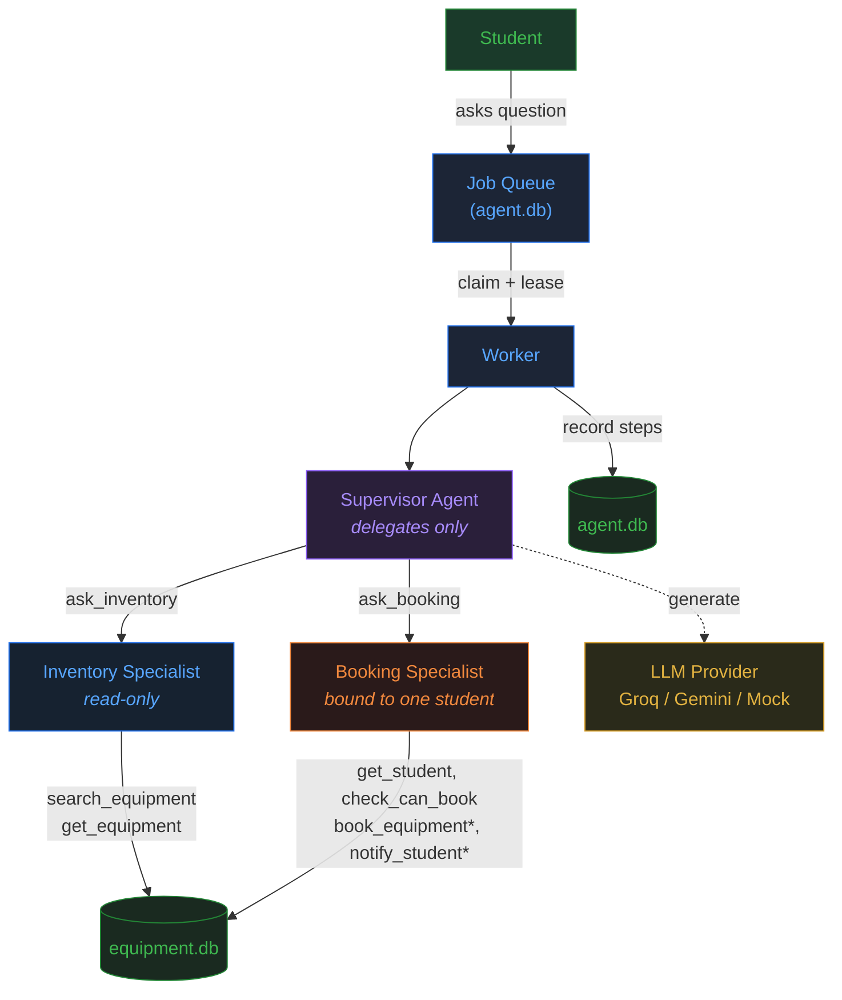

# Lab Equipment Booking Assistant

An end-to-end multi-agent system for campus lab equipment booking. A student asks a question in
plain English. A **supervisor** agent delegates to two **specialist** agents: an inventory
specialist that can only look, and a booking specialist that can book equipment and send texts.
The run is a job on a queue, and a worker that dies halfway through doesn't book the equipment
twice.

## System Architecture

> **Interactive diagram**: open [`docs/architecture.html`](docs/architecture.html) in a browser for the full visual version.



### Component Details

```
┌──────────────────────────────────────────────────────────────────────────────┐
│                           Lab Equipment Booking System                       │
├──────────────────────────────────────────────────────────────────────────────┤
│                                                                              │
│  ┌─────────┐    ┌───────────┐    ┌────────────────────────────────────────┐  │
│  │ Student  │───▶│  Queue    │───▶│           Worker                      │  │
│  │ (ask.py) │    │ (agent.db)│    │  ┌──────────────────────────────────┐ │  │
│  └─────────┘    └───────────┘    │  │       Supervisor Agent           │ │  │
│                                   │  │  (delegates only, no tools)      │ │  │
│                                   │  └────┬───────────────────┬────────┘ │  │
│                                   │       │                   │          │  │
│                                   │  ┌────▼─────────┐  ┌─────▼────────┐ │  │
│                                   │  │  Inventory   │  │   Booking    │ │  │
│                                   │  │  Specialist  │  │  Specialist  │ │  │
│                                   │  │  (read-only) │  │ (read+write) │ │  │
│                                   │  │              │  │  bound to    │ │  │
│                                   │  │ search_equip │  │  one student │ │  │
│                                   │  │ get_equip    │  │              │ │  │
│                                   │  └──────────────┘  │ get_student  │ │  │
│                                   │                     │ check_can_bk │ │  │
│                                   │                     │ book_equip*  │ │  │
│                                   │                     │ notify_stud* │ │  │
│                                   │                     └──────────────┘ │  │
│                                   └──────────────────────────────────────┘  │
│                                                                              │
│  ┌──────────────────┐  ┌──────────────────┐                                 │
│  │  equipment.db     │  │  agent.db         │                                │
│  │  ────────────     │  │  ────────         │                                │
│  │  student          │  │  thread           │                                │
│  │  training         │  │  message          │                                │
│  │  equipment        │  │  run (queue)      │                                │
│  │  booking          │  │  run_step         │                                │
│  │  policy           │  │  tool_call        │                                │
│  │  notification     │  │                   │                                │
│  │  idempotency      │  │                   │                                │
│  └──────────────────┘  └──────────────────┘                                 │
└──────────────────────────────────────────────────────────────────────────────┘
```

### Key Design Choices


| Concept | Implementation |
|---|---|
| **Two databases** | `equipment.db` (domain data) and `agent.db` (memory + queue) |
| **Six tools** | 2 read-only (search, get) + 4 booking (get_student, check, book, notify) |
| **Business rules in data** | `policy` table: max_fine_to_book, max_active_bookings; `training` table for cert requirements |
| **Queue + worker** | Lease-based; dead worker's run is picked up by another |
| **Idempotency** | Every side effect runs through `EquipmentDb.once`; booking and notification are also safe to repeat on their own |
| **Multi-agent** | Supervisor delegates to inventory (no write tools) and booking (bound to one student) |
| **LLM Provider** | Groq (qwen/qwen3.8-27b) or Gemini; scripted mocks for tests/demo |

## Step-by-Step Setup

### Step 1: Clone the Repository

```bash
git clone https://github.com/Jagan-cloud1512/day-4.git
cd day-4
```

### Step 2: Create Virtual Environment

**Windows (PowerShell):**
```powershell
python -m venv .venv
.venv\Scripts\activate
```

**Windows (Git Bash):**
```bash
python -m venv .venv
source .venv/Scripts/activate
```

**Mac/Linux:**
```bash
python3 -m venv .venv
source .venv/bin/activate
```

You should see `(.venv)` at the start of your prompt.

### Step 3: Install Dependencies

```bash
pip install -r requirements.txt
```

This installs:
- `groq` — Groq LLM API client
- `google-genai` — Gemini API client (optional fallback)
- `pytest` — test runner
- `supabase` — Supabase client (optional, for cloud DB)

### Step 4: Run WITHOUT any API key (scripted models)

No environment variables needed. Works immediately.

```bash
# Normal demo — two questions, every step printed
python -m scripts.demo

# Crash recovery demo — worker dies mid-run, second worker finishes
python -m scripts.demo --crash

# Run all 24 tests
pytest
```

### Step 5: Set Up Groq for Real Models (optional)

**a) Get a Groq API key:**
1. Go to https://console.groq.com
2. Sign up / log in
3. Go to API Keys → Create new key
4. Copy the key

**b) Set the environment variable:**

**Windows (PowerShell):**
```powershell
$env:GROQ_API_KEY = "gsk_your_key_here"
```

**Windows (CMD):**
```cmd
set GROQ_API_KEY=gsk_your_key_here
```

**Mac/Linux:**
```bash
export GROQ_API_KEY=gsk_your_key_here
```

**c) Run with real models:**
```bash
python -m scripts.demo --real
```

If `GROQ_API_KEY` is set, Groq is used. Otherwise falls back to Gemini (`export GEMINI_API_KEY=...`).

### Step 6: Two-Terminal Mode (optional)

**Terminal 1 — start the worker:**
```bash
python -m scripts.worker
```

**Terminal 2 — send questions:**
```bash
python -m scripts.ask --student 22CS045 "Do you have an oscilloscope?"
python -m scripts.ask --student 22IT017 "Can I book a Raspberry Pi?"
python -m scripts.ask --student 22EC031 "What have I booked?"
```

### Step 7: Set Up Supabase (optional — cloud database)

**a) Create a Supabase project** at https://supabase.com/dashboard

**b) Run SQL in the Supabase SQL Editor** (in order):
1. `schema/supabase_library.sql` — creates equipment tables
2. `schema/supabase_agent.sql` — creates agent tables
3. `schema/supabase_setup.sql` — disables RLS + seeds data

**c) Set environment variables:**

**Windows (PowerShell):**
```powershell
$env:SUPABASE_URL = "https://your-project-ref.supabase.co"
$env:SUPABASE_KEY = "your-anon-key"
$env:USE_SUPABASE = "1"
```

**Mac/Linux:**
```bash
export SUPABASE_URL="https://your-project-ref.supabase.co"
export SUPABASE_KEY="your-anon-key"
export USE_SUPABASE=1
```

## Quick Reference

| Command | What it does | Needs API key? |
|---|---|---|
| `python -m scripts.demo` | Full demo, scripted models | No |
| `python -m scripts.demo --crash` | Crash recovery demo, prints PASS | No |
| `pytest` | Run all 24 tests | No |
| `python -m scripts.demo --real` | Demo with real Groq models | Yes (`GROQ_API_KEY`) |
| `python -m scripts.worker` | Start a worker (Terminal 1) | Yes (`GROQ_API_KEY`) |
| `python -m scripts.ask "question"` | Queue a question (Terminal 2) | No (worker needs key) |

## Workflow

### How a Question Flows Through the System

```
1. Student sends: "Is an oscilloscope available? Book it for me."
                │
2. QUEUED       ▼
   RunStore.enqueue() → saves message + creates Run (status: "queued")
                │
3. CLAIMED      ▼
   Worker.run_once() → claim_next() atomically sets status: "running" + lease
                │
4. SUPERVISOR   ▼
   Supervisor agent receives the question
   LLM decides: call ask_inventory("Is there an oscilloscope?")
                │
5. INVENTORY    ▼
   Inventory specialist (read-only, separate agent loop)
   → search_equipment("oscilloscope")
   → equipment.db: SELECT ... WHERE name LIKE '%oscilloscope%'
   → Returns: "Oscilloscope DSO-X2000, 3 units available"
                │
6. SUPERVISOR   ▼
   LLM sees inventory result
   LLM decides: call ask_booking("Book equipment 1, send confirmation")
                │
7. BOOKING      ▼
   Booking specialist (bound to student 22CS045)
   → check_can_book(1)     ← policy table: fine OK, booking limit OK, training OK
   → book_equipment(1)     ← side effect through once() with idempotency key
     └── equipment.db: UPDATE units_available -= 1, INSERT booking
   → notify_student(msg)   ← side effect, deduplicated by message+date hash
     └── equipment.db: INSERT notification ON CONFLICT DO NOTHING
   → Returns: "Booked and sent confirmation"
                │
8. ANSWER       ▼
   Supervisor gives final answer to student
   RunStore.complete() → saves reply + status: "succeeded"
```

### What Happens on Crash

```
Worker-A runs steps 1-7... booking is COMMITTED to equipment.db
   ██ CRASH ██ (worker-A dies before notification)
        │
   Lease expires (60s) → reap_expired() finds the abandoned run
        │
Worker-B claims the run → rebuild() reads recorded steps from agent.db
   → Replays booking specialist:
     → check_can_book(1)    ← fresh call, still OK
     → book_equipment(1)    ← once() finds existing key → REPLAYED, no duplicate
     → notify_student(msg)  ← fresh call, sends the notification
   → Run completes successfully

Result: exactly 1 booking, exactly 1 notification (no duplicates)
```

### Policy Refusal (Arjun with fine)

```
Student 22IT017 (fine = Rs 75): "Can I book an Arduino?"
        │
   Supervisor → ask_inventory → "Arduino available, 4 units"
   Supervisor → ask_booking → "Book it"
        │
   Booking specialist:
     check_can_book(2) → policy("max_fine_to_book") = 50
                        → Arjun fine = 75 > 50 ✗ REFUSED
     book_equipment(2) → calls check_can_book internally → STILL REFUSED
                          (enforces policy even if model skips the check)
        │
   Answer: "You can't book: fine Rs 75 exceeds Rs 50 limit"
```

## Seed Data

| Student | Fine | Max bookings | Training | What happens |
|---|---|---|---|---|
| 22CS045 Priya Raman | Rs 0 | 2 | electronics, 3dprinting | Can book |
| 22IT017 Arjun Kumar | Rs 75 | 2 | none | Refused: fine above Rs 50 policy |
| 22EC031 Divya Sekar | Rs 0 | 1 | electronics | Refused: already holds 1 booking |

Equipment: 1 Oscilloscope (3 units, needs electronics), 2 Arduino Mega (4 of 5 on shelf),
3 3D Printer Prusa (1 unit, needs 3dprinting), 4 Raspberry Pi 5 (4 units),
5 Logic Analyzer (2 units, needs electronics), 6 Soldering Station (0 on shelf, needs electronics).

## Where Each Requirement Shows Up

| Requirement | Where to look |
|---|---|
| Two SQLite databases | `schema/equipment.sql`, `schema/agent.sql` |
| Five+ tools with descriptions | `app/tools/equipment_tools.py` (6 tools, 120+ char docstrings) |
| Business rule in data | `policy` table + `training` table; `check_can_book` enforces even if model skips |
| Queue and worker | `app/memory.py`, `app/worker.py`, `app/runner.py` |
| Idempotency | `EquipmentDb.once`, `EquipmentDb.book` (safe to repeat), `record_notification` (dedupe) |
| Two+ agents | Supervisor → inventory specialist (read-only) + booking specialist (write) |
| Proof without key | `python -m scripts.demo`, `python -m scripts.demo --crash` prints PASS, `pytest` |
| Groq real-model run | `python -m scripts.demo --real` with GROQ_API_KEY set |
